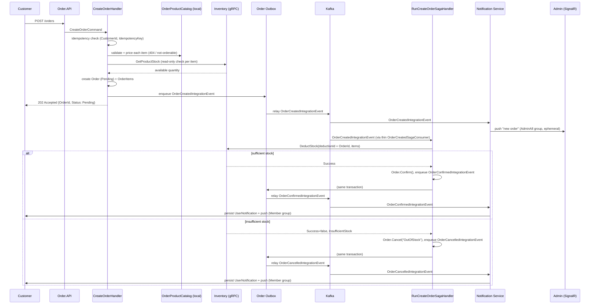

# Reference: CreateOrder Saga

**Scope:** the end-to-end CreateOrder workflow — validation, the Pending→Confirmed/Cancelled saga, event flow, compensation, retry/idempotency strategy, and extension points. This is the first (and, as of this writing, only) consumer of `BuildingBlock.Saga` — see [reference/saga.md](saga.md) for the generic building block itself. Read [services/order-service.md](../services/order-service.md) and [services/inventory-service.md](../services/inventory-service.md) first for the entities/routes this doc assumes.

## Why a saga at all

Creating an order touches three services (Order, Inventory, Notification) and has a genuine partial-failure case: inventory can turn out to be insufficient *after* the order is already persisted (a concurrent order can win the race between Order's read-only stock check and the actual deduction). That failure must cancel the order and give back nothing it never took — a single local transaction can't express that, so this is one of the few workflows in this codebase that legitimately needs orchestration with compensation rather than `IUnitOfWork.ExecuteTransactionAsync` alone.

## End-to-end flow

## Phase-by-phase

### 1. Validation (`CreateOrderHandler`, synchronous, in the request)

- **Idempotency** — if the request carries an `IdempotencyKey`, `(CustomerId, IdempotencyKey)` is looked up first (unique partial index on `orders`); a match short-circuits and returns the existing order instead of creating a duplicate. Guards against double-submit (double-click, client retry after a timed-out-but-actually-succeeded response).
- **Item validation** — `CreateOrderValidator` (FluentValidation) rejects empty/duplicate/oversized item lists and out-of-range quantities before the handler runs at all (max 50 items/order, 1-100 qty/item, no duplicate ProductId per order).
- **Product validation** — every requested `ProductId` (semantically a `VariantId` — see the naming note in [services/order-service.md](../services/order-service.md)) is resolved against the locally-synced `OrderProductCatalog`, never trusted from the request. Missing → 404. Present but `Status != "Active"` (`OrderProductCatalog.IsOrderable`) → rejected immediately (`InvalidStateException`, 400). Name/price are always taken from the catalog snapshot.
- **Inventory validation** — a read-only `GetProductStock` gRPC call per item confirms `TotalQuantity >= requested`. **This never reserves anything** — it's a fast-fail UX check; the actual deduction happens later, in the saga, and is the only place that's authoritative (see "the TOCTOU gap" below).
- If everything passes: the Order (`Pending`) + `OrderItem`s are persisted and `OrderCreatedIntegrationEvent` is enqueued to the Outbox, in the same `SaveChangesAsync` call — atomic, and the HTTP response (**202 Accepted**) returns immediately without waiting on inventory deduction or confirmation.

### 2. Saga trigger (`OrderCreatedSagaConsumer`, Order.Infrastructure)

A thin `IIntegrationEventConsumer` — deserializes `OrderCreatedIntegrationEvent` and dispatches `RunCreateOrderSagaCommand` via `ISender`. It intentionally has **no other dependency** (not `IOrderRepository`, not `IUnitOfWork`, not the saga steps themselves). This matters mechanically, not just stylistically: `AddKafkaMessaging`'s `DiscoverConsumerTopics` builds a temporary `IServiceProvider`+scope, synchronously disposed, purely to read every registered consumer's `Topics` — and eagerly constructs every consumer to do so. A consumer whose constructor pulls in a DbContext-backed `IUnitOfWork` (`IAsyncDisposable`-only) breaks that eager construction with `'...' type only implements IAsyncDisposable. Use DisposeAsync to dispose the container.` — a real startup crash, not just a design-time artifact. Every consumer in this codebase (see [reference/events.md](events.md#dos-and-donts)) stays this thin for exactly this reason; the saga is no exception.

### 3. Saga execution (`RunCreateOrderSagaHandler`, Order.Application)

Builds an `ISagaContext` (`SagaId = OrderId.ToString()`) and a two-step `ISagaDefinition` (`CreateOrderSagaDefinitionFactory`):

| Step | Action | Compensation |
|---|---|---|
| **DeductInventory** | gRPC `DeductStock(deductionId: OrderId, items)` | gRPC `RestockStock(deductionId: OrderId)` — reverses the deduction |
| **ConfirmOrder** | `Order.Confirm()`, enqueue `OrderConfirmedIntegrationEvent`, `SaveChangesAsync` | no-op (last step; `SagaOrchestrator` only compensates *completed* earlier steps, never the one that just failed) |

`SagaOrchestrator` (unmodified `BuildingBlock.Saga` code) runs steps in order; on any exception it marks the saga `Failed`, compensates completed steps in reverse, persists the record via `EfSagaStore`, and rethrows `SagaExecutionException`. The handler's `catch` blocks give the two failure branches their actual business meaning:

- **`ex.FailedStepName == DeductInventoryStep.Name`** → terminal business outcome. Nothing was completed to compensate. The handler cancels the order itself (`Order.Cancel("OutOfStock")` or whatever failure code Inventory returned, enqueues `OrderCancelledIntegrationEvent`). Saga ends.
- **`ex.InnerException is InvalidStatusException`** (only reachable from `ConfirmOrder`, e.g. a manual `CancelOrder` request raced the saga) → the order already left `Pending`; `DeductInventory`'s compensation already restocked; logged and treated as a safe no-op, not retried (retrying would throw the same exception forever).
- **Anything else** (e.g. a transient DB error inside `ConfirmOrder`) → left to propagate. `DeductInventory`'s compensation has already restocked, so the order is back to a clean, retryable state; Inbox's retry/backoff redelivers `OrderCreatedIntegrationEvent` and the whole saga runs again.

### 4. Downstream reactions (Notification Service)

Steps 3/4 of the original brief ("Notification", "Realtime Update") are **not** synchronous saga steps — they're independent, event-driven reactions. `NotificationTriggerConsumer` (Notification.Infrastructure) is itself a thin adapter (only `ISender`/`IAppLogger`, same reasoning as `OrderCreatedSagaConsumer` in step 2 above — `ActorHubFacade`'s own dependency, `IHubContext` from `AddSignalR()`, isn't registered until Notification.API's presentation layer, too late for `DiscoverConsumerTopics`' eager construction) that dispatches a Command per event; the actual push happens in that command's handler, resolved lazily by MediatR:

| Event | Command dispatched | Realtime push | Persisted? |
|---|---|---|---|
| `OrderCreatedIntegrationEvent` | `NotifyNewOrderToAdminsCommand` → `NotifyNewOrderToAdminsHandler` | `IAdminSiteActions.OrderCreated(NewOrderNotificationDto)` to the `AdminAll()` group | No — no single recipient for a role-wide broadcast; a push dropped for a disconnected admin is harmless, the order is still in their queue on next load. |
| `OrderConfirmedIntegrationEvent` | `CreateUserNotificationCommand` **and** `NotifyOrderStatusUpdatedCommand` | Former pushes the generic `IGlobalHubBase.ReceiveNotification` (Notification Center/bell icon); latter pushes `IClientSiteActions.OrderStatusUpdated(OrderStatusUpdatedDto)` to `Member(customerId)` so the frontend can patch its own order view directly, without parsing free text. | Yes (`UserNotification`, via the first command) |
| `OrderCancelledIntegrationEvent` | Same two commands, `Status: "Cancelled"`, `Reason` set, `TotalAmount: null` (not carried by this event) | Same two pushes | Yes |

Two distinct SignalR client methods exist for this reason — `IAdminSiteActions.OrderCreated` and `IClientSiteActions.OrderStatusUpdated` — rather than overloading the generic `ReceiveNotification`, so each frontend surface (admin approval queue vs. a customer's order view) gets a structured, purpose-built payload instead of having to parse an `OrderId` out of a notification's title/body text.

This is deliberate, not an oversight: routing customer/admin notifications through the synchronous saga would mean a Notification-side outage rolls back a legitimately-confirmed order, which directly contradicts "Notification unavailable → retry, don't fail the order." Reusing Outbox→Kafka→Inbox for this fan-out means retry/backoff/dead-letter and duplicate-delivery safety come for free from existing infrastructure — nothing saga-specific was built for it. The pushes themselves (`IRealtimeNotifier`, backed by `ActorHubFacade`) are called directly from each command handler rather than through the `NotificationDispatch`/`NotificationDispatchWorker` queue (which polls once a minute) because they must appear "instantly", and a persisted `UserNotification` (where one exists) is already the durable fallback for a disconnected recipient.

## Events (all in `BuildingBlock.Contract.Events.Order`)

- **`OrderCreatedIntegrationEvent`** — `OrderId`, `CustomerId`, `Items` (`VariantId`/`ProductName`/`Quantity`/`UnitPrice`), `TotalAmount`. Fires the saga *and* the admin-queue notification.
- **`OrderConfirmedIntegrationEvent`** — `OrderId`, `CustomerId`, `TotalAmount`. Fires the customer "confirmed" notification.
- **`OrderCancelledIntegrationEvent`** — `OrderId`, `CustomerId`, `Reason`. Fires the customer "cancelled" notification; used both by the saga's compensation path (`Reason: "OutOfStock"`) and by the manual `CancelOrder` command (`Reason: "CancelledByCustomer"`, or whatever the caller passes) — same event, same downstream reaction, regardless of which path cancelled the order.

All three are enqueued via `IOutboxStore.EnqueueAsync` in the same `SaveChangesAsync` as the aggregate change that caused them — no exception to the standard Outbox pattern (see [reference/events.md](events.md)).

## Idempotency strategy

| Boundary | Mechanism |
|---|---|
| `POST /orders` submitted twice | Optional client `IdempotencyKey`, unique per `(CustomerId, IdempotencyKey)` — a repeat returns the original order. |
| `OrderCreatedIntegrationEvent` redelivered | Standard Inbox dedup (`(messageId, consumerName)`), automatic for every consumer including `OrderCreatedSagaConsumer` — see [reference/inbox-outbox-runtime.md](inbox-outbox-runtime.md). |
| Saga re-run for the same order (Inbox retry, consumer restart) | `SagaId = OrderId` — `EfSagaStore` overwrites the same history row rather than creating a new one. |
| `DeductStock` called twice for the same order | Inventory's `StockDeduction` ledger, keyed by `deductionId = OrderId` — a repeat replays the stored outcome (`Succeeded`/`Failed`) instead of decrementing twice. gRPC has no Outbox/Inbox of its own, so this ledger is what makes a direct RPC call safe under retry. |
| `RestockStock` called twice (or for a deduction that never succeeded) | Looks up the same ledger row; reversing an already-`Reversed` (or never-`Succeeded`) deduction is a no-op `Success: true` — a compensating action must never itself become a blocking failure. |

## Concurrency

- **`orders.xmin` / `inventories.xmin`** — Postgres's native `xmin` system column, mapped as an EF concurrency token (see `OrderConfig`/`InventoryConfig`). Guards against two writers racing the same row (e.g. `ConfirmOrderStep` vs. a manual `CancelOrder` request; `DeductStock` vs. `StockOut` vs. a concurrent `DeductStock` for a different order hitting the same variation). `EfUnitOfWork.ExecuteTransactionAsync` translates the resulting `DbUpdateConcurrencyException` into an Application-layer `ConflictException` so callers above Persistence never need to know EF/Npgsql-specific types exist. `DeductStockHandler`/`RestockStockHandler` retry up to 3 times on `ConflictException`, re-validating against fresh quantities each attempt (never blindly retrying stale numbers).
- **The TOCTOU gap between Phase 1's read-only stock check and the saga's actual deduction is expected, not a bug.** Two customers can both pass the pre-check for the last unit; only one wins the real deduction. That's exactly why Phase 3 is documented as "never reserve" and the saga — not the synchronous request — is the sole authority on whether stock was actually available.

## Failure scenarios

| Scenario | Outcome |
|---|---|
| Inventory unreachable during the read-only pre-check (Phase 3) | `CreateOrderCommand` fails synchronously (gRPC exception propagates), order is never created. Client sees an error and can retry the whole request. |
| Inventory reports insufficient stock during `DeductStock` | Order → `Cancelled` (`OutOfStock`), customer notified. Saga ends; no retry (this is a correct, final outcome). |
| Inventory unreachable during `DeductStock` (transport error) | `DeductInventoryStep` throws, nothing was completed yet (no compensation needed), `SagaExecutionException.FailedStepName == DeductInventory` — but the exception's *inner* exception is an RPC failure, not `InventoryDeductionFailedException`, so it does **not** match the "cancel as OutOfStock" catch clause; it propagates and Inbox retries the whole saga later. *(If Inventory being down should instead cancel the order immediately rather than retry, that's a one-line change to the consumer's catch guard — not implemented, since "retry" is the documented behavior for this case per the task brief's Phase 8.)* |
| `ConfirmOrder` fails after `DeductInventory` succeeded (DB blip) | Orchestrator compensates `DeductInventory` (restocks), saga marked `Failed`, `SagaExecutionException` rethrown untouched by the handler's catch clauses → Inbox retries the whole saga from a clean, re-validated state. |
| Manual `CancelOrder` races the saga's `ConfirmOrder` | Whichever commits first wins the `xmin` check; the loser gets `ConflictException` (if concurrent) or `InvalidStatusException` (if sequential) — the saga's catch clause for `InvalidStatusException` treats this as a safe stop, not a retry. |
| Consumer/service restart mid-saga | Safe. Nothing about correctness depends on in-memory state — Outbox/Inbox guarantee `OrderCreatedIntegrationEvent` is eventually (re)delivered, and every downstream action (`DeductStock`, `RestockStock`, `Cancel`, `Confirm`) is idempotent or naturally re-runnable. |
| Outbox replay (relay redelivers an already-processed message) | Safe — Inbox dedup on the consumer side, idempotent handlers on top of that. |
| Order stuck `Pending` after repeated saga failures exhaust Inbox retries (dead-lettered) | Not auto-resolved today — surfaces as a `DeadLetter` Inbox row with no requeue UI yet (a known, pre-existing gap, see [reference/events.md](events.md#implementation-status)). This is exactly the gap the *future* Admin Approval saga is meant to cover (manual intervention on stuck/ambiguous orders) — see Future Extension Points below. |

## Future extension points

The two-step saga was kept deliberately minimal so later workflows can be added as their own sagas/steps without rewriting this one:

- **Payment** — a `ChargePaymentStep` would slot in after `ConfirmOrder`, or as its own saga triggered off `OrderConfirmedIntegrationEvent`, with `RefundStep` as its compensation.
- **Shipping/Delivery** — same shape: a new saga triggered off confirmation, independent of this one.
- **Admin Approval** — Pending orders already sit visibly in the admin queue (the `OrderCreatedIntegrationEvent` broadcast); a future "Approve/Reject" saga would consume an admin action rather than a stock outcome, and would be the natural place to resolve orders this saga couldn't (see the dead-letter scenario above).
- **Coupon/Promotion/Reward Points** — additional validation/pricing steps in `CreateOrderHandler`'s Phase 2, or additional saga steps if they need their own compensation (e.g. releasing a reserved coupon).
- **New order states beyond Cancelled/Confirmed/Completed** — `OrderStatus`'s transitions are centralized in the `Order` aggregate's own methods (`Confirm`/`Cancel`/`Complete`), never set directly by a handler or saga step, so adding a state is a domain-layer change with one obvious place to make it.

None of these require touching `CreateOrderSagaDefinitionFactory`'s existing two steps, `DeductInventoryStep`, or `ConfirmOrderStep` — only adding new ones.
